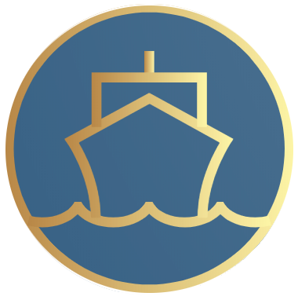

<!-- PROJECT LOGO -->
<br />
<p align="center">
  <a href="https://github.com/oslabs-beta/ShipShape">
    
  </a>

  <h3 align="center">ShipShape</h3>

  <p align="center">
    Kubernetes Cluster Monitoring Made Easy
    <br /><br />
    <a href="https://www.getinshipshape.io/"><strong>getinshipshape.io</strong></a>
    <br />
    <br />
   
  </p>
</p>

<!-- TABLE OF CONTENTS -->
<details open="open">
  <summary>Table of Contents</summary>
  <ol>
    <li>
      <a href="#about-the-project">About The Project</a>
      <ul>
        <li><a href="#built-with">Built With</a></li>
      </ul>
    </li>
    <li>
      <a href="#demo">Demo</a>
    </li>
    <li>
      <a href="#getting-started">Getting Started</a>
      <ul>
        <li><a href="#prerequisites">Prerequisites</a></li>
        <li><a href="#installing-shipshape">Installation</a></li>
        <li><a href="running-shipshape">Running ShipShape</a></li>
      </ul>
    </li>
    <li><a href="#contributors">Contributors</a></li>
    <li><a href="#looking-ahead">Looking Ahead</a></li>
  </ol>
</details>

<!-- ABOUT THE PROJECT -->

## About The Project

ShipShape is an open-source Web App for Kubernetes monitoring. ShipShape allows Users to track numerous Kubernetes Cluster metrics with easy to interpret graphs at varying levels of granularity.

Key features include:

<!-- * User authentication and authorization -->

- A facilitated access of internal Kubernetes environment without having to expose it to outside traffic
- Instructions for auto-deployment of Prometheus for time-series metrics
- GraphQL service to abstract PromQL queries for frontend developers
- There are different dashboard views of Kubernetes clusters (cluster, node, and pod view)
- Graphs that display important metrics
- Dynamic time-range and filtering selection for cluster metric data

### Built With

- [Kubernetes](https://kubernetes.io/)
- [Prometheus](https://prometheus.io/)
- [React](https://reactjs.org/)
- [Chart JS](https://www.chartjs.org/)
- [Node JS/Express](https://nodejs.dev)
- [Apollo GraphQL](https://www.apollographql.com/docs/apollo-server)
- [Webpack](https://webpack.js.org/)
- [Jest](https://jestjs.io/)

## Demo


## Getting Started

To get a local copy up and running, follow these steps:

### Prerequisites

1.  Installed on your local machine, [kubectl](https://kubernetes.io/docs/tasks/tools) and [helm](https://helm.sh/docs/intro/install) command line tools.
2.  Have a hosted Kubernetes Cluster on a service like [EKS](https://aws.amazon.com/eks/), [GKE](https://cloud.google.com/kubernetes-engine), or [MiniKube](https://minikube.sigs.k8s.io/docs/start).
3.  A metrics server installed inside the cluster, if it is not standard with your cluster service. For metrics server deployment, see our [Getting Started](https://www.getinshipshape.io/getStarted) for instructions on setting this up.
4.  Ensure that your local kubeconfig is setup to access the cluster you wish to monitor. You can check that by running the following command and checking the cluster info displayed in your shell.

```
kubectl config view
```

5.  Expose metrics using Prometheus from a Kubernetes cluster. This can be done easily via Helm once the above steps are complete.

```
helm repo add prometheus-community https://prometheus-community.github.io/helm-charts
```

```
helm upgrade -i prometheus prometheus-community/prometheus --namespace prometheus
```

ShipShape requires that you have a running Kubernetes cluster and your local kubeconfig file setup to access it. You can check your configuration by running

```
kubectl config view
```

### Installing ShipShape

Before running ShipShape the first time, you'll need to pull the codebase down to your local machine and compile the bundle.js for optimal performance.

1. Fork and/or clone this repo to get started

```
git clone https://github.com/oslabs-beta/ShipShape.git
```

2. Cd into the cloned Directory

```
cd ShipShape
```

3. Npm install in the ShipShape root directory

```
npm install
```

4. Npm run build

```
npm run build
```

### Running ShipShape

After installation is complete, you can start here to boot up ShipShape in the future.

1. Start the server

```
npm start
```

2. Navigate to http://localhost:3000
3. Click "Dashboard" to view your metrics!

### Demo Mode

To see a working demo of ShipShape:

Navigate to the <a href="https://www.getinshipshape.io/"><strong>ShipShape</strong></a> demo dashbaord!

<!-- CONTRIBUTORS -->

## Contributors

Brian Barr - [GitHub](https://github.com/BarrBrian/) - [LinkedIn](https://www.linkedin.com/in/barrbrian/)

Ozi Oztourk - [GitHub](https://github.com/ozi-oztrk/) - [LinkedIn](https://www.linkedin.com/in/ozi-oztourk/)

Rebecca Schell - [GitHub](https://github.com/rschelly/) - [LinkedIn](https://www.linkedin.com/in/rschelly/)

Whit Rooke - [GitHub](https://github.com/Whitrooke) - [LinkedIn](https://www.linkedin.com/in/whit-rooke)

## Looking Ahead

ShipShape is currently in Alpha. Here's some features we hope to have implemented in future versions:

- More options for which metrics you monitor
- More filtering options for “Cluster View” metrics with dynamic PromQL queries
- Impment a state management framework (Redux/Context API)
- UI Optimization for faster rendering
- Prometheus Auto-Deployment to streamline setup
- Organization and user permissions to share access to your metrics with employees without sharing your provider access keys

### Have an idea to make ShipShape even better?

If you'd like to contributee to ShipShape, please open a PR from your personal fork, or shoot us an email at ShipShapeK8S@gmail.com and our team will work with you to get the feature implemented.
