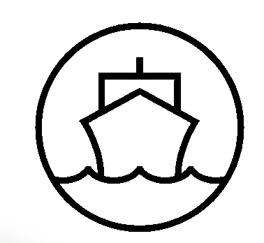

<!-- PROJECT LOGO -->
 

  

  <h3 align="center">ShipShape</h3>

  

    Kubernetes Cluster Monitoring Made Easy
      
    <a href="https://www.getinshipshape.com/"><strong>getinshipshape.com</strong></a>
     
     
   
  

<!-- TABLE OF CONTENTS -->

  
Table of Contents

  <ol>
    <li>
      <a href="#about-the-project">About The Project</a>
      <ul>
        <li><a href="#built-with">Built With</a></li>
      </ul>
    </li>
    <li>
      <a href="#demo">Demo</a>
    </li>
    <li>
      <a href="#getting-started">Getting Started</a>
      <ul>
        <li><a href="#prerequisites">Prerequisites</a></li>
        <li><a href="#installation">Installation</a></li>
      </ul>
    </li>
    <li><a href="#contributors">Contributors</a></li>
    <li><a href="#looking-ahead">Looking Ahead</a></li>
  </ol>

<!-- ABOUT THE PROJECT -->
## About The Project

ShipShape is an open-source Web App for Kubernetes monitoring. ShipShape allows Users to track numerous Kubernetes Cluster metrics with easy to interpret graphs at varying levels of granularity.

Key features include:
<!-- * User authentication and authorization -->
* A facilitated access of internal Kubernetes environment without having to expose it to outside traffic
<!-- * Auto-deployment of Prometheus for time-series metrics -->
* GraphQL service to abstract PromQL queries for frontend developers
* Diffenent dashboard views of Kubernetes clusters 
* Graphs that display important metrics
* Dynamic date selection for metric data

### Built With

* [Kubernetes](https://kubernetes.io/)
* [Prometheus](https://prometheus.io/)
* [React](https://reactjs.org/)
* [Chart JS](https://www.chartjs.org/)
* [GraphQL](https://graphql.org)
* [Webpack](https://webpack.js.org/)
* [Node JS/Express](https://nodejs.dev)
* [Jest](https://jestjs.io/)

## Demo

### Track and Monitor Cluster Metrics 

Description of what is happening up in the gif above 

### Maybe a vid of another view 

Description of the thing happening above 

<!-- GETTING STARTED -->
## Getting Started

To get a local copy up and running, follow these steps.

### Prerequisites
<!-- 1.  Crate a [Google OAth](https://developers.google.com/identity/protocols/oauth2) account. -->
<!-- 2.  Expose metrics using Prometheus from a Kubernetes cluster.  You can either expose a live cluster or use [MiniKube](https://minikube.sigs.k8s.io/docs/start/).  -->
1. figure it out 

### Setup

### Installing this repo
1. Fork this repo.
2. npm install
3. npm run build

<!-- CONTRIBUTORS -->
## Contributors

Brian Barr - [GitHub](https://github.com/BarrBrian/) - [LinkedIn](https://www.linkedin.com/in/barrbrian/)

Ozi Oztourk - [GitHub](https://github.com/ozi-oztrk/) - [LinkedIn](https://www.linkedin.com/in/ozi-oztourk/)

Rebecca Schell - [GitHub](https://github.com/rschelly/) - [LinkedIn](https://www.linkedin.com/in/rschelly/)

Whit Rooke - [GitHub](https://github.com/Whitrooke) - [LinkedIn](https://www.linkedin.com/in/whit-rooke)

## Looking Ahead 

More tests pls